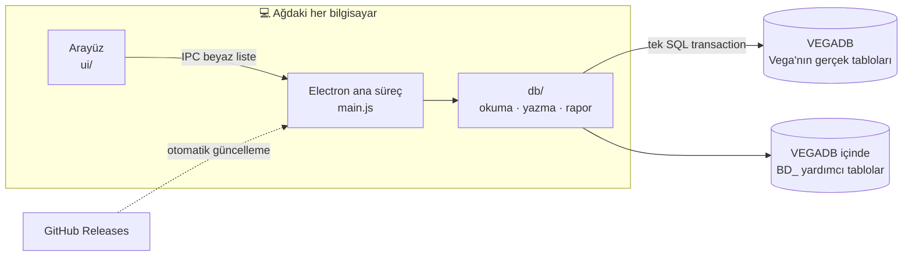
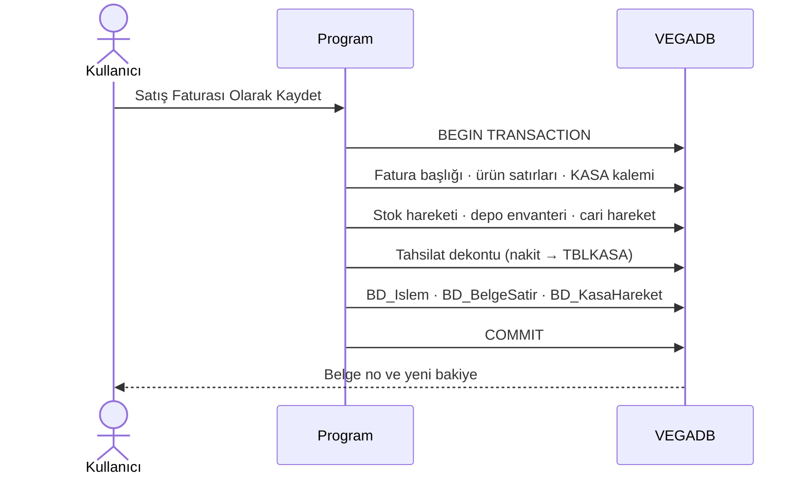
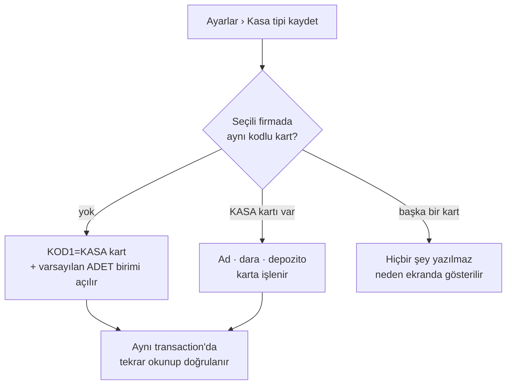

<div align="center">

# 🧺 Hızlı Belge Doldurucu

### Sebze-meyve toptancısı için haftalık satış girişi, kasa depozito takibi — doğrudan VegaWin'e

[](https://github.com/saidbayraqtars/hizli-belge-doldurucu-releases/releases/latest)


**Eski Access programının yerine geçer.** Farkı: girilen belge ara bir veritabanında
beklemez, **tek bir SQL işleminde doğrudan VegaWin'in kendi tablolarına** yazılır.

[Ne yapar](#-ne-yapar) •
[Nasıl çalışır](#-nasıl-çalışır) •
[Kasa tipleri](#-kasa-tipleri-ve-vega-kartı) •
[Güncelleme ve bakım](#-güncelleme-ve-otomatik-bakım) •
[Kurulum](#-kurulum) •
[Geliştirme](#-geliştirme)

</div>

---

> [!IMPORTANT]
> **Tek kural: aşırı basit olsun.** Belge girecek kişi bilgisayardan pek anlamayan biri.
> Ekrana özellik eklemeden önce gerçekten isteniyor mu diye bakın — "faydalı olur" diye
> eklenen şey burada kusur sayılır.

## ✨ Öne çıkanlar

<table>
<tr>
<td width="50%" valign="top">

### ⚡ Tek tuşla Vega'ya
Satış faturası ya da cari giriş, ürün + kasa + tahsilat **tek transaction'da**.
Yarım belge oluşmaz; bir adım hata verirse hiçbir satır kalmaz.

### 🧺 Kasa depozito defteri
Hangi müşteride kaç kasa ve kaç TL depozito açık — adet bazında.
İade, verildiği günkü gerçek tutarı kapatır.

### ↩️ Her belge geri alınabilir
Hangi Vega satırının yazıldığı günlükte durur; **Geri Al** iz bırakmadan siler,
**✎ Düzenle** tek işlemde değiştirir.

</td>
<td width="50%" valign="top">

### 📊 Eski programın raporları
Pazar→Cumartesi haftalık borç dökümü, fiş fiş ayrıntılı ekstre, toplu yazdırma.
Toplamlar Vega'nın kendi bakiyesiyle birebir tutar.

### 🔎 "Google gibi" arama
`hasan cinar`, `çınar hasan`, `HASAN ÇINAR` — aynı kart. Kelimeler ayrı ayrı,
sırasız, Türkçe harf farkı yok sayılır.

### 🛡️ Varsayılan kapalı yazma
Kilit açılmadan VEGADB'ye tek satır yazılmaz. Güncellemeler kendiliğinden gelir,
geçmiş kayıtları yedekli onarır.

</td>
</tr>
</table>

## 🖥️ Ne yapar

Program altı sekmeden oluşur:

| Sekme | İş |
|---|---|
| 📝 **Belge Gir** | Asıl ekran. Müşteri seçilir, satırlar girilir, Vega'ya yazılır |
| 🧺 **Kasa** | Müşterideki açık kasalar ve tek tuşla kasa iadesi |
| 📊 **Haftalık Rapor** | *GENEL MÜŞTERİYE GÖRE KALAN* borç dökümü |
| 📄 **Ekstre** | Cari ekstre, fiş bazlı ayrıntılı rapor, haftalık giriş/çıkış |
| 🗂️ **Son Belgeler** | Yazılan belgelerin günlüğü — düzenle / geri al |
| ⚙️ **Ayarlar** | Sunucu, firma/dönem, depo, yazma kilidi, kasa tipleri |

### 📝 Belge Gir

Tarihin yanındaki **Özel Kod 1** süzgeci müşteri listesini daraltır. Seçenekler sabit
değildir: cari kartlarının **Özel Kod 1** (`KOD1`) alanında ne yazıyorsa o değerler,
yanlarında kaç kart olduğuyla listelenir. Açılışta `TOPTAN` varsa o seçili gelir, yoksa
*Hepsi*. Kartlarda alan hiç dolu değilse süzgeç ekranda görünmez.

| Alan | Açıklama |
|---|---|
| **Cinsi** | VEGADB stok kartından seçilir — "Google gibi" arama |
| **Brüt Miktar** | Kasayla birlikte tartılan kg; ürün seçiminden sonra ilk bu alan doldurulur |
| **Kasa Adedi** | Kaç kasa/kap gitti |
| **Kasa Tipi** | Seçili firmada Vega kartı `KOD1 = KASA` olan tipler |
| **Dara** | Kasa adedi × tipin darası — *kendiliğinden* |
| **Daralı Miktar** | Brüt − dara — *kendiliğinden* |
| **Fiyat** | Elle girilir; kartta fiyat varsa öneri olarak gelir |
| **Tutar** | Daralı miktar × fiyat — *kendiliğinden* |
| **Kasa Tutarı** | Kasa adedi × depozito — *kendiliğinden* |
| **Açıklama** | İsteğe bağlı rapor notu; Vega belge satırına **yazılmaz** |

**Tahsilat** alanına tutar girilirse ayrı bir **cari giriş (tahsilat)** dekontu yazılır.
Yanındaki *Tahsilat Belge Açıklaması* belge başlığına gider (boşsa `Tahsilat`). Tahsilat
Vega'ya **NAKİT** yazılır (`IZAHAT=1`, `PORTNO=-1`) ve Vega'nın kasa defterine
(`TBLKASA`, `ISLEMTIPI=1`) gelir olarak düşer.

Ürün seçmek zorunlu değil: yalnız kasa verilen satır ya da yalnız tahsilat girilen belge
de kaydedilebilir. Altta iki tuş var:

| Tuş | Vega'da ne olur |
|---|---|
| **Satış Faturası Olarak Kaydet** | Satış faturası; ürün ve kasa ayrı kalem, stok düşer |
| **Cari Giriş Olarak Kaydet** | Cari giriş dekontu; ürün ve kasa iki kalem, stok etkilenmez |

<details>
<summary>⌨️ Klavye kısayolları</summary>

| Tuş | Davranış |
|---|---|
| `Tab` | Sağa ilerler; Fiyat'tan sonra Açıklama/Sil'i atlayıp alttaki satırın ürününe geçer, son satırda yeni satır açar |
| `↓` / `Enter` | Alttaki satırın aynı sütunu |
| `↑` | Üstteki satır |
| `↑ ↓` + `Enter`/`Tab` | Ürün kutusu açıkken listede gezinip seçer |

Açıklama ve Sil fareyle kullanılır.
</details>

### 🧺 Kasa

Müşteriye verilen kasalar borcuna eklenir; kasalar geri gelince buradan tek tuşla düşülür
ve Vega'ya **Stok Giriş İade Fişi** olarak yazılır. İade tutarı kartın bugünkü bedelinden
değil, o müşteride açık duran **gerçek depozito borcundan** adet oranında hesaplanır:

> 9 kasa 500 TL'den verilmiş, kart bedeli sonra 300 TL olmuş → 9 kasanın tamamı dönünce
> **4.500 TL'nin tamamı** kapanır; kalan adet ve tutar sıfır olur.

### 📊 Haftalık Rapor

Çok müşterili **borç dökümü**, her müşteri tek satır. Hafta **Pazar başlar, Cumartesi
biter**; ok tuşlarıyla hafta değişir. **Kart tipi** (alıcı/satıcı) ve **Özel Kod 1**
süzgeçleri listeyi daraltır (burada varsayılan *Hepsi*).

| Sütun | Nedir |
|---|---|
| ESKİ BORÇ | Hafta başından önceki bakiye − hafta içinde alınan ödeme |
| KASA | Hafta içindeki kasa/kap depozito tutarı |
| YENİ BORÇ | Hafta içindeki ürün borcu (kasa hariç) |
| TOP.BAKİYE | ESKİ BORÇ + KASA + YENİ BORÇ — Vega'daki gerçek hafta sonu bakiyesi |

TOP.BAKİYE doğrudan `TBLCARIHAREKETLERI`'nden hesaplanır, ESKİ BORÇ ondan geriye çıkarılır:
satır her zaman tam toplanır. Satır kutucuklarıyla **birden fazla müşteri** seçilip yalnız
onlar yazdırılabilir ya da **Seçilenlerin Ekstresi** her biri ayrı sayfada hazırlanır.
Bir müşteriye tıklamak onu Ekstre'de aynı haftayla açar.

### 📄 Ekstre

- **Ayrıntılı Rapor (fiş bazlı)** — `CİNSİ | K.ADET | K.TÜRÜ | K.TUTAR | FİYAT | TUTAR |
  AÇIKLAMA | FİŞ NO`, fiş fiş gruplu, ara toplamlı, en altta genel toplam; *Geri Gelen
  Kasalar*, ÖDEME ve BAKİYE blokları. Aynı fişte aynı kasa türü tek kez toplanır.
  Çıktı bilerek dar: ürünü çok olan müşteride sayfa sayısı düşük kalsın.
- **Toplu yazdırma** — her müşteri yeni sayfada; sonda boş sayfa çıkmaz.
- **Pazardan pazara gezinme**, **Haftalık Giriş/Çıkış tablosu** ve anında çalışan
  **süzgeçler** (tür, yön, açıklama/evrak no, en az tutar).

### 🗂️ Son Belgeler

Tarih, tür, müşteri, Vega belge no, tutar. Arama kutusu müşteri, belge no, fiş no, tür ve
kullanıcıda birlikte arar. **✎** belgeyi forma geri açar: 1–2 kg gibi hatalar düzeltilip
yeniden kaydedilir — eski ve yeni kayıt **tek transaction'da** değişir, yeni yazım
başarısızsa eski belge korunur. **Geri Al** belgeyi Vega'dan ve yardımcı tablolardan
tamamen siler; bakiye işlem öncesine döner.

**Müşteri listesi** — arama kutusunun altındaki *Listeden Seç* bütün müşterileri
gezilebilir pencerede açar. Yeni cari kartı bu programdan açılmaz; kartlar Vega'dan seçilir.

## 🧠 Nasıl çalışır



Bir satış belgesi kaydedildiğinde olan her şey tek işlemdir:



### 🗄️ Programın kendi veritabanı yok

Vega'da bulunmayan dört küçük şey **VEGADB'nin içine**, `BD_` önekli tablolara kurulur:

| Tablo | Ne tutar | Neden Vega'da yok |
|---|---|---|
| `BD_KasaTipi` | Kasa/kap tipi listesi; defter tipin sabit Id'sine bağlı | Vega kart numarası firmadan firmaya değişir |
| `BD_KasaHareket` | Müşteride kaç kasa açık (verilen/iade) | `TBLCARIHAREKETLERI` para tutar, adet tutmaz |
| `BD_Islem` | Hangi Vega satırına ne yazıldığı | Geri alma bunsuz yapılamaz |
| `BD_BelgeSatir` | Girilen her satırın dökümü | Faturasız belgede Vega'da satır kırılımı hiç yok |

Bu dört tablo dışında hiçbir belge, müşteri ya da stok bilgisi programın kendi tarafında
durmaz.

### 🔐 Vega'ya yazma kilidi

Program varsayılan olarak **VEGADB'ye hiçbir şey yazmaz**; yalnız okuma ekranları çalışır.
Yazmak için Ayarlar'daki **"Vega'ya yazmayı aç"** işaretlenir. Açmadan önce
[`kurulum/BELGE-DESENI.md`](kurulum/BELGE-DESENI.md) okunmalı: hangi yazma deseninin canlı
doğrulandığı orada işaretli.

> [!WARNING]
> Cari giriş/çıkış başlığında **Şube** (`OZELKOD1`) ve **Kasa** (`OZELKOD2`) mutlaka
> doldurulur — o firmanın kendi belgelerinden en çok geçen değer okunur. Boş kalırsa
> kullanıcı belgeyi Vega'da açıp doldurunca Vega belgeyi yeniden postalar ve cariye
> **ikinci bir hareket** yazar.

Ödeme aracı alanları (`IZAHAT`, `PORTNO`, `BANKANO`) yalnız **tahsilat** dekontunda
doldurulur; müşteriyi borçlandıran ürün/kasa dekontunda bilerek boş kalır, yoksa Vega'nın
kasa raporunda karşılığı olmayan para görünür.

### 🔢 Satış faturası serisi

Numara önce o firma/dönemde **Vega'nın kendi serisini** arar (`TBLSATFATBASLIK.BELGENO`'daki
en sık tek harf önek, ör. `A`) ve oradan devam eder. Hiç fatura yoksa Ayarlar'daki öneğe
(varsayılan `H`) düşer. Sayaç program genelinde tektir ve `WITH (UPDLOCK, HOLDLOCK)` ile
okunur: programın ağdaki kopyaları aynı anda kaydetse de numara çakışmaz.

## 🧺 Kasa tipleri ve Vega kartı

Bir kasa tipi yalnız seçili firmada **aynı `STOKKODU`, `KOD1 = KASA`, silinmemiş ve tek
varsayılan birimli** bir Vega kartı varsa listelenir. Dara birimin `AGIRLIK`'ından,
depozito `SATISFIYATI1`'den canlı okunur.



- Açılan kartın alanları tahmin değil: VegaWin'in **kendi açtığı** kasa kartlarından
  alındı — kart ile birim çift yönlü bağlı (`BIRIMEX = ANABIRIM = birim IND`), `%0` KDV
  grubu orana bakılarak seçilir, `{GUID}` UID yazılır.
- `STOKKODU` Vega'da benzersizdir; **silinmiş kart da kodu tutar**. Ürün kartı
  kendiliğinden kasaya çevrilmez.
- Kayıtlı tipin kodu değiştirilemez. Harf büyüklüğü Vega'nın Türkçe harmanına bırakılır
  (`i` büyüyünce `İ`).
- Silinen tip seçilemez; Vega kartı ve geçmiş hareketler durur.

## 🔄 Güncelleme ve otomatik bakım

Program açılışta ve her 4 saatte bir yeni sürümü kontrol eder, arka planda indirir ve
*"Şimdi kur"* diye sorar; kullanıcı bir şey yapmazsa program kapanırken kurulur.

Yeni sürüm ilk açıldığında, sürüm + sunucu + veritabanı başına **bir kez**, sırayla:

| Adım | Ne yapar | Ayrıntı |
|---|---|---|
| 1️⃣ Geçmiş belge bakımı | Tarih karışıklığını ve kasa defteri farklarını iki kaynaktan kanıtlayıp düzeltir | `kurulum/gecmis-belgeleri-duzelt.js` |
| 2️⃣ Eksik kasa kartları | Programdan açılıp Vega'ya işlenmemiş kasa tiplerinin kartını açar | [`KASA-KARTI-ONARIM.md`](kurulum/KASA-KARTI-ONARIM.md) |
| 3️⃣ Kasa satırı onarımı | Yanlış karta düşmüş geçmiş kasa satırlarını gerçek karta bağlar | aynı belge |

Her düzeltmeden önce JSON geri alma yedeği `%LOCALAPPDATA%\hizli-belge-doldurucu-bakim`
altına yazılır. Vega ile kaynaklar çelişirse veri uydurulmaz, kayıt *elle inceleme*'ye
bırakılır. Yazma kapalıysa ya da bir adım hata verirse bakım bitmiş sayılmaz, sonraki
açılışta yeniden denenir.

<details>
<summary>🛠️ Bakımı elle çalıştırmak</summary>

Varsayılan çalışma **salt okunurdur**, yalnız rapor üretir:

```powershell
npm run bakim:gecmis                 # geçmiş belgeler
npm run bakim:kasa                   # kasa kartları ve satırları
npm run bakim:kasa -- --fis 00751    # tek fiş
```

Uygulamak ve geri almak:

```powershell
npm run bakim:gecmis -- --uygula
npm run bakim:kasa   -- --uygula
npm run bakim:kasa   -- --geri-al "C:\...\kasa-karti-yedek-....json"
```

Kaynak kod olmayan müşteri bilgisayarında kurulu programın Electron'uyla nasıl
çalıştırılacağı [`kurulum/KASA-KARTI-ONARIM.md`](kurulum/KASA-KARTI-ONARIM.md) içinde.
</details>

## 🚀 Kurulum

**1. SQL kullanıcısı** — bir kez, sunucuda. `kurulum/sql-kullanici-olustur.sql` içindeki
şifreyi değiştirip çalıştırın:

```powershell
sqlcmd -S localhost -E -C -i kurulum\sql-kullanici-olustur.sql
```

`belge_doldurucu` kullanıcısı VEGADB üzerinde `db_owner` alır: program yardımcı tabloları
kendisi kurar ve yazar. Yazılabilirlik ayrıca programdaki kilitle korunur.

**2. Program** — her bilgisayara. [Son sürümün](https://github.com/saidbayraqtars/hizli-belge-doldurucu-releases/releases/latest)
`Hizli-Belge-Doldurucu-Setup-x.y.z.exe` dosyası kurulur. Ayarlar'dan sunucu ve şifre
girilir, **Bağlantıyı Dene** ile doğrulanır, firma/dönem seçilip kaydedilir, yazma açılır.
Firma ve dönem listesi sabit değildir: veritabanında gerçekten bulunanlar, her dönemin
hareket sayısı ve son hareket tarihiyle gösterilir.

**3. Ağdaki diğer bilgisayarlar** — SQL Server'da TCP/IP açık ve 1433 portu izinli olmalı;
aynı kurulum dosyası kurulur, `sunucu` alanına SQL Server makinesinin adı yazılır. Kasa
defteri VEGADB içinde durduğu için her bilgisayarda aynı görünür.

## 🪟 Windows 7 desteği

Program Windows 7 SP1 ve sonrasında çalışır. Sürümler bilerek geride tutuldu —
**yükseltmeyin**:

| Bileşen | Sürüm | Neden |
|---|---|---|
| Electron | **22.3.27** | Windows 7/8/8.1 destekleyen son sürüm |
| Node (gömülü) | 16.17 | Electron 22 ile gelir; Node 18+ Windows 7'yi bıraktı |
| mssql | **9.3.2** | tedious 15, Node 16 ile çalışır; mssql 10+ Node 18 ister |

- Kurulum dosyası **x64 ve 32-bit** üretilir.
- Donanım hızlandırması kapalı — eski ekran kartlarında pencere bomboş açılıyordu.
- SQL'de `TRY_CAST`, `OFFSET/FETCH`, `IIF`, `CONCAT`, `THROW` yok; rol ataması
  `sp_addrolemember` ile — sunucu SQL Server 2008 olabilir.
- Arayüzde özel font ve dış kaynak yok; CSP tüm dış istekleri kapatır.
- Windows oturumuyla bağlanma paketlenmez (`msnodesqlv8` yerel sürücüsü 32/64-bit ayrı
  derleme ister). Gerekirse `windowsGirisi: true` ve yeniden derlemeyle açılabilir.

## 🧪 Geliştirme

```powershell
npm install
npm start              # programı çalıştır
npm run test:db        # okuma sınaması
npm run test:rapor     # rapor birim testleri
npm run test:yazma     # yazma sınaması (VEGA_TEST gerekir)
npm run dist           # kurulum dosyası (x64 + 32-bit)
npm run yayinla        # derle ve GitHub Releases'e yükle
```

Sınamalar bağlantıyı proje kökündeki `ayarlar.json`'dan alır.

### Yazma sınaması

Yazma yolu **müşteri verisine dokunmadan**, yapısı VEGADB'den kopyalanmış boş bir
`VEGA_TEST` veritabanında sınanır:

```powershell
sqlcmd -S localhost -E -C -i kurulum\vega-test-olustur.sql
npm run test:yazma
```

Sınama adı `VEGA_TEST`'ten farklı bir veritabanı görürse **hiçbir şey yapmadan çıkar**.
Kapsadığı başlıca konular: faturanın beş tablodaki bağları, cari bakiye, tahsilatın nakit
yazılması, cari girişte stoğun etkilenmemesi, kasa defteri ve iadesi, kasa kartının
programdan açılması ve çakışan kodun reddi, güncelleme bakımları ve geri almanın hiç iz
bırakmaması.

> [!TIP]
> **`ELECTRON_RUN_AS_NODE` tuzağı.** Bu değişken kabukta tanımlıysa Electron pencere
> açmaz ve `Cannot read properties of undefined (reading 'disableHardwareAcceleration')`
> verir. Temizleyin: `unset ELECTRON_RUN_AS_NODE` ya da PowerShell'de
> `Remove-Item Env:ELECTRON_RUN_AS_NODE`.

### 📁 Dosya düzeni

```text
main.js                 Electron ana süreç, IPC uçları, güncelleme sonrası bakım
preload.js              Arayüzün erişebildiği kanal beyaz listesi
ui/                     Arayüz (index.html · app.css · app.js) — çerçeve yok
db/
├─ ayar.js              ayarlar.json okuma/yazma
├─ sql.js               bağlantı havuzu, sorgu ve transaction yardımcıları
├─ firma.js             firma/dönem keşfi, tablo adı üretimi
├─ vega.js              VEGADB okumaları (yazma yok)
├─ yazma.js             VEGADB'ye yazan her şey — varsayılan kapalı
├─ kasa.js              kasa tipi ↔ Vega kasa kartı eşleşmesi, kart açma
├─ yardimci.js          VEGADB içindeki BD_ tabloları
├─ rapor.js             haftalık rapor ve ayrıntılı döküm
├─ cari.js              cari listesi
└─ guncelleme.js        otomatik güncelleme
kurulum/
├─ BELGE-DESENI.md      yazma deseni — yazmaya dokunmadan önce okunur
├─ KASA-KARTI-ONARIM.md kasa kartı ve geçmiş satır onarımı
├─ gecmis-belgeleri-duzelt.js · kasa-kartlarini-onar.js   bakım araçları
├─ sql-kullanici-olustur.sql · vega-test-olustur.sql      kurulum betikleri
└─ test-*.js            sınamalar
```

> [!NOTE]
> Kod ve değişken adları **Türkçe**. Sürdürün — yarısı Türkçe yarısı İngilizce bir kod
> tabanını okumak zorlaşıyor.

## 📌 Bilinen durum

- Fatura serisi tespiti yeni bir firma/dönemde ilk kez kullanılırken bulunan harf gözle
  doğrulanmalı.
- İade fişinin `AFIYATI`/`BIRIMMALIYET` deseni gerçek VegaWin girişiyle yeniden
  karşılaştırılana kadar önceki değerler korunuyor.
- Program simgesi yok, varsayılan Electron simgesi kullanılıyor.

<div align="center">

---

**Bayraktar Yazılım** · VegaWin ile birlikte çalışan, VegaWin'in yerini almayan bir yardımcı

</div>
